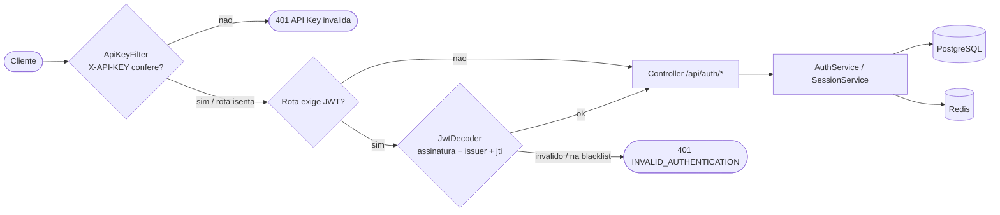
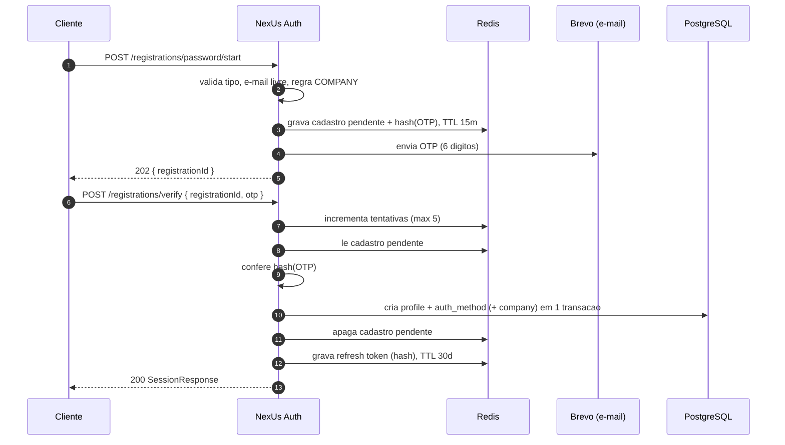
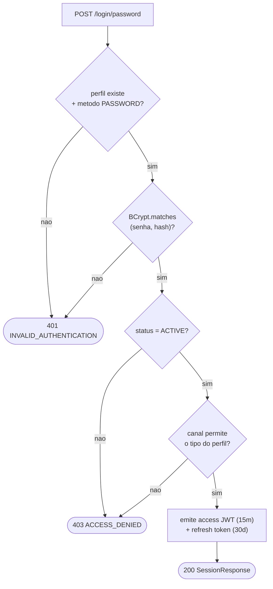
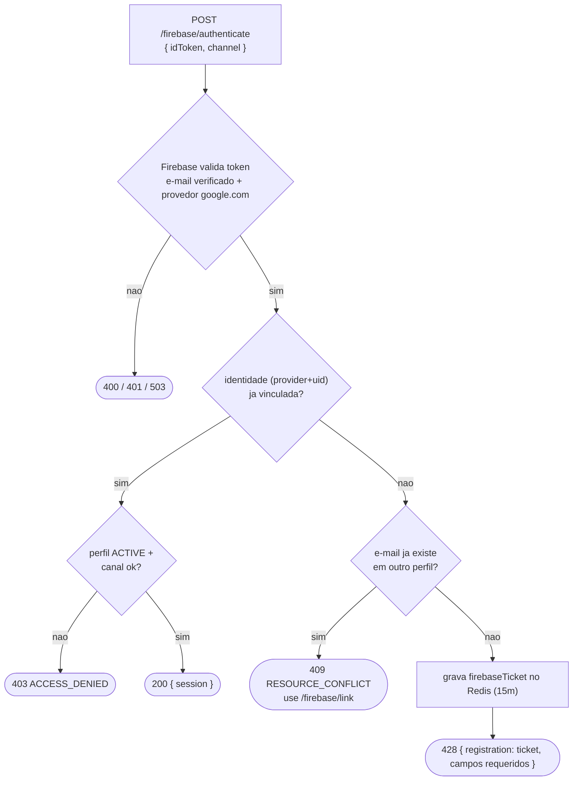
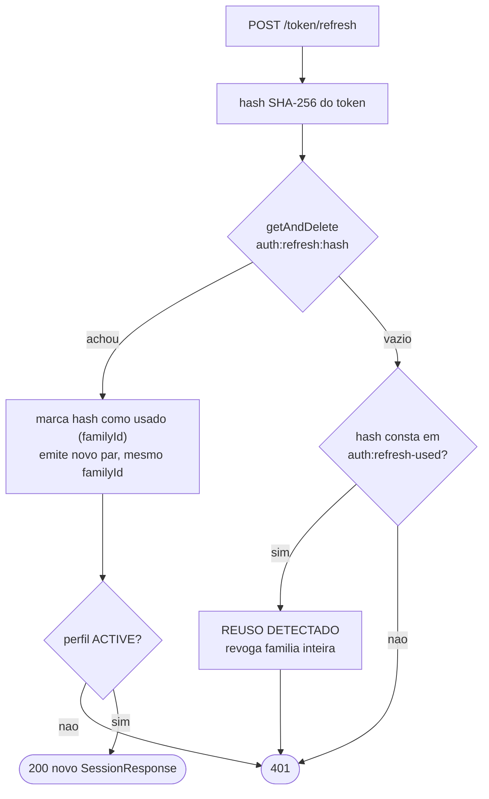
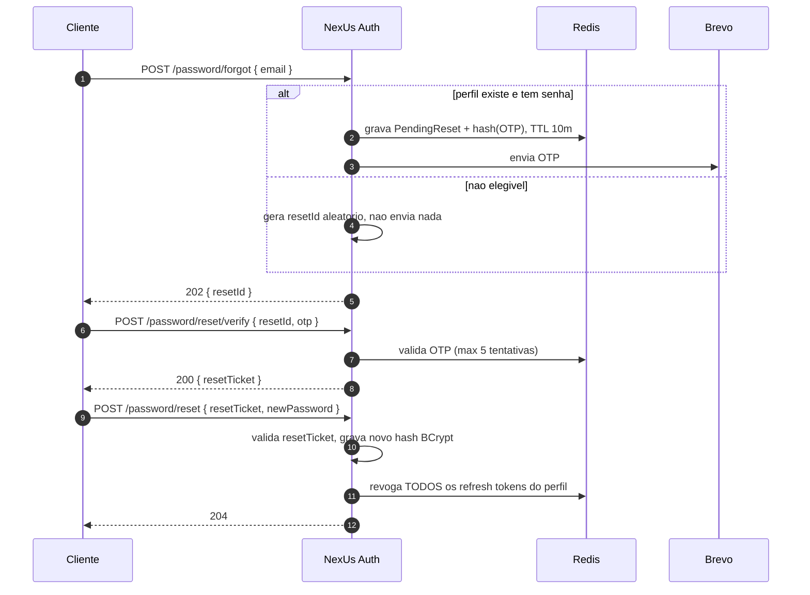

# NexUs Auth API — Referência Técnica

**Versão:** 1.0.0
**Base path:** `/api/auth`
**Formato:** `application/json`
**Spec viva:** `/swagger-ui.html` · **OpenAPI:** `/v3/api-docs`
**Stack:** Spring Boot 4.1 · Java 17 · PostgreSQL · Redis
**Licença:** MIT

> Serviço de autenticação do ecossistema NexUs: cadastro e login por senha, login
> federado via Firebase (Google), verificação em duas etapas por e-mail e sessões
> com *access token* JWT e *refresh token* rotativo.

---

## Sumário

1. [Visão geral](#1-visão-geral)
2. [Arquitetura & stack](#2-arquitetura--stack)
3. [Autenticação de acesso](#3-autenticação-de-acesso)
4. [Modelo de dados](#4-modelo-de-dados)
5. [Índice de endpoints](#5-índice-de-endpoints)
6. [Endpoints em detalhe](#6-endpoints-em-detalhe)
7. [Fluxogramas](#7-fluxogramas)
8. [Regras de negócio](#8-regras-de-negócio)
9. [Modelo de erros](#9-modelo-de-erros)
10. [Tokens & sessões](#10-tokens--sessões)
11. [Qualidades do serviço](#11-qualidades-do-serviço)
12. [Observabilidade](#12-observabilidade)
13. [Configuração de ambiente](#13-configuração-de-ambiente)
14. [Termos de uso & licença](#14-termos-de-uso--licença)

---

## 1. Visão geral

A NexUs Auth é a única porta de entrada de identidade da plataforma. Ela não expõe
dados de perfil para leitura nem gerencia recursos de negócio — sua
responsabilidade é **provar quem é o chamador** e emitir credenciais de sessão que
os demais serviços NexUs validam.

### O que a API faz

- Cadastra perfis `HOUSEHOLD` (residência) e `COMPANY` (empresa) através de um fluxo
  pendente confirmado por código OTP enviado por e-mail.
- Autentica por e-mail + senha (hash BCrypt) ou por *ID token* do Firebase
  (provedor Google, e-mail verificado).
- Emite sessões: um *access token* JWT HS256 de vida curta e um *refresh token*
  opaco de vida longa, com rotação e detecção de reúso.
- Permite recuperação de senha por OTP, encerramento de sessão (logout) e vínculo
  de uma identidade Firebase a uma conta já existente.

### O que a API não faz

- Não valida o JWT para os outros serviços — cada serviço é um *resource server*
  que valida o token com o segredo compartilhado.
- Não cria perfis `ADMIN` ou `STORE`: apenas `HOUSEHOLD` e `COMPANY` aceitam
  registro público.
- Não oferece endpoint de leitura/edição de perfil, endereço ou plano.
- Não persiste o refresh token em banco — todo estado efêmero vive no Redis com TTL.

---

## 2. Arquitetura & stack

Aplicação Spring Boot stateless. O PostgreSQL guarda o que é permanente (perfil,
método de autenticação, empresa, endereço); o Redis guarda o que é temporário
(cadastros pendentes, tickets Firebase, OTPs, refresh tokens, blacklist de JWT).

| Camada | Tecnologia | Papel |
|---|---|---|
| Runtime | Spring Boot 4.1 / Java 17 | API REST (`spring-boot-starter-webmvc`) |
| Segurança | Spring Security + OAuth2 Resource Server | Filtro de API Key + validação de JWT (HS256) |
| Persistência | Spring Data JPA / Hibernate | Perfis e credenciais em PostgreSQL |
| Migrações | Flyway | `V1` schema inicial, `V2` remove Microsoft, `V3` torna endereço opcional |
| Estado efêmero | Redis (`StringRedisTemplate`) | OTP, cadastros pendentes, refresh tokens, blacklist |
| Identidade federada | Firebase Admin SDK 9.9 | Verificação do *ID token* Google |
| E-mail | Brevo (API HTTP `v3/smtp/email`) | Entrega do código OTP |
| Observabilidade | Actuator + Micrometer + Prometheus | Métricas e painel `/tracing` |
| Docs | springdoc-openapi 2.8 | Swagger UI e `/v3/api-docs` |

### Pipeline de uma requisição



Toda rota passa pelo `ApiKeyFilter`. Rotas isentas: `/swagger-ui`, `/v3/api-docs`,
`/actuator/**`, `/tracing/**`, `/static`. Só `/api/auth/logout` e
`/api/auth/firebase/link` exigem também o JWT.

---

## 3. Autenticação de acesso

Há dois níveis de credencial. A **API Key** autoriza o cliente a falar com o
serviço; o **Bearer JWT** identifica um usuário autenticado e só é exigido em dois
endpoints.

### 3.1 API Key — obrigatória em todo `/api/auth/**`

| | |
|---|---|
| Header | `X-API-KEY: <valor>` |
| Origem | Variável de ambiente `API_KEY` (propriedade `app.api-key`) |
| Falha | `401` com corpo `{"error":"API Key inválida"}` (lançado por `UnauthorizedException` no filtro) |
| Comparação | Igualdade exata de string |

> ⚠️ A API Key é um segredo compartilhado entre back-ends. Ela não deve ser
> embarcada em aplicativos móveis ou SPAs públicas — o tráfego do cliente final
> deve passar por um *gateway*/BFF que injeta o header.

### 3.2 Bearer JWT — exigido em `logout` e `firebase/link`

| | |
|---|---|
| Header | `Authorization: Bearer <access token>` |
| Algoritmo | HS256, segredo `JWT_SECRET_BASE64` (≥ 32 bytes decodificados) |
| Validações | Assinatura, `iss` = `JWT_ISSUER`, expiração, e `jti` ausente da blacklist Redis |
| Claims | `sub` (id do perfil), `jti`, `profile_type`, `email`, `iss`, `iat`, `exp` |
| Authority | `profile_type` vira `ROLE_<TIPO>` no contexto de segurança |

---

## 4. Modelo de dados

### ProfileType — tipo de perfil

| Valor | Significado | Registro público? | Campos obrigatórios extras |
|---|---|---|---|
| `HOUSEHOLD` | Residência / usuário doméstico | Sim | `address` obrigatório |
| `COMPANY` | Empresa cliente | Sim | `cnpj` + `planId` (plano ativo) |
| `ADMIN` | Operador da plataforma | Não | — |
| `STORE` | Loja vinculada a uma empresa | Não | — |

### Channel — canal de acesso (no login)

| Valor | Uso | Tipos de perfil admitidos |
|---|---|---|
| `PLATFORM` | Console web da plataforma | `COMPANY`, `ADMIN` |
| `MOBILE` | Aplicativo | `COMPANY`, `HOUSEHOLD` |

### ProfileStatus

| Valor | Efeito |
|---|---|
| `ACTIVE` | Único status que autentica |
| `INACTIVE` | Bloqueia login e refresh |
| `BLOCKED` | Bloqueia login e refresh |

### AuthProvider

| Valor | Credencial armazenada |
|---|---|
| `PASSWORD` | Hash BCrypt (força 12) |
| `GOOGLE` | `uid` do Firebase |

### AddressRequest — endereço (objeto aninhado)

| Campo | Tipo | Obrig. | Regra |
|---|---|---|---|
| `neighborhood` | string | sim | ≤ 100 caracteres |
| `street` | string | sim | ≤ 150 caracteres |
| `number` | string | sim | ≤ 10 caracteres |
| `cep` | string | sim | exatamente 8 dígitos (`\d{8}`) |
| `city` | string | sim | ≤ 100 caracteres |
| `state` | string | sim | 2 letras (`[A-Za-z]{2}`) |

### SessionResponse — corpo de sessão emitida

```json
{
  "accessToken": "eyJhbGciOiJIUzI1NiJ9...",
  "accessTokenExpiresAt": "2026-09-02T18:15:00Z",
  "refreshToken": "9f2c...(43 chars, base64url)",
  "refreshTokenExpiresAt": "2026-10-02T18:00:00Z"
}
```

`accessTokenExpiresAt` = agora + 15 min · `refreshTokenExpiresAt` = agora + 30 dias.

---

## 5. Índice de endpoints

| Método | Caminho | Função | Sucesso | Acesso |
|---|---|---|---|---|
| POST | `/api/auth/registrations/password/start` | Inicia cadastro por senha, envia OTP | 202 | API Key |
| POST | `/api/auth/registrations/firebase/start` | Inicia cadastro com ticket Firebase, envia OTP | 202 | API Key |
| POST | `/api/auth/registrations/verify` | Confirma OTP e cria a conta + sessão | 200 | API Key |
| POST | `/api/auth/login/password` | Login por e-mail + senha | 200 | API Key |
| POST | `/api/auth/firebase/authenticate` | Login federado ou pedido de cadastro | 200 / 428 | API Key |
| POST | `/api/auth/token/refresh` | Rotaciona o refresh token e emite novo access | 200 | API Key |
| POST | `/api/auth/logout` | Revoga a sessão atual | 204 | API Key + JWT |
| POST | `/api/auth/password/forgot` | Solicita OTP de recuperação de senha | 202 | API Key |
| POST | `/api/auth/password/reset/verify` | Confirma o OTP de recuperação e devolve um `resetTicket` | 200 | API Key |
| POST | `/api/auth/password/reset` | Redefine a senha com o `resetTicket` | 204 | API Key |
| POST | `/api/auth/firebase/link` | Vincula identidade Google à conta logada | 204 | API Key + JWT |
| GET | `/tracing` | Redireciona ao painel de métricas | 302 | chave `?key=` |

A API Key (`X-API-KEY`) é exigida em todas as rotas `/api/auth/**`. `/tracing` e
`/actuator/**` são isentos dela.

---

## 6. Endpoints em detalhe

Cada endpoint aceita e devolve JSON. Erros seguem o [modelo de erros](#9-modelo-de-erros).

---

### 6.1 `POST /api/auth/registrations/password/start`

**Acesso:** `X-API-KEY`

Primeira etapa do cadastro por senha. Valida os dados, garante que o e-mail está
livre, guarda um *cadastro pendente* no Redis (TTL 15 min) com o OTP em hash e
dispara o e-mail com o código. **Nada é gravado no banco ainda.**

**Corpo — `PasswordRegistrationStartRequest`**

| Campo | Tipo | Obrig. | Regras |
|---|---|---|---|
| `type` | ProfileType | sim | Só `HOUSEHOLD` ou `COMPANY` |
| `email` | string | sim | Formato e-mail, ≤ 255, único (case-insensitive) |
| `password` | string | sim | 8 a 72 caracteres |
| `name` | string | sim | ≤ 150 caracteres |
| `phones` | string[] | opcional | Cada item casa `\+[1-9][0-9]{7,14}` (E.164) |
| `address` | AddressRequest | condicional | Obrigatório se `type=HOUSEHOLD` |
| `profileImageUrl` | string | opcional | ≤ 500 caracteres |
| `cnpj` | string | condicional | 14 dígitos; obrigatório se `COMPANY`, proibido caso contrário |
| `planId` | number | condicional | Plano ativo; obrigatório se `COMPANY`, proibido caso contrário |

**Requisição**

```http
POST /api/auth/registrations/password/start
X-API-KEY: <chave>
Content-Type: application/json

{
  "type": "HOUSEHOLD",
  "email": "ana@casa.com",
  "password": "segredo-forte-1",
  "name": "Ana Prado",
  "phones": ["+5511988887777"],
  "address": {
    "neighborhood": "Centro",
    "street": "Rua A",
    "number": "100",
    "cep": "01001000",
    "city": "São Paulo",
    "state": "SP"
  }
}
```

**Resposta · 202 Accepted**

```json
{ "registrationId": "a3f1c9e2-...-uuid" }
```

Guarde o `registrationId`: ele é a chave para a etapa de verificação. O OTP tem 6
dígitos e viaja apenas por e-mail.

**Erros:** `400 VALIDATION_ERROR` · `400 INVALID_REQUEST` (regra COMPANY/HOUSEHOLD) ·
`409 RESOURCE_CONFLICT` (e-mail/CNPJ em uso)

---

### 6.2 `POST /api/auth/registrations/verify`

**Acesso:** `X-API-KEY`

Segunda etapa comum aos dois fluxos de cadastro (senha e Firebase). Confere o OTP,
revalida que o e-mail e o CNPJ continuam livres, **cria o perfil, o método de
autenticação e (se empresa) a empresa numa única transação**, apaga o cadastro
pendente e devolve uma sessão pronta.

**Corpo — `VerifyOtpRequest`**

| Campo | Tipo | Obrig. | Regras |
|---|---|---|---|
| `registrationId` | string | sim | O UUID devolvido no `start` |
| `otp` | string | sim | Exatamente 6 dígitos (`\d{6}`) |

**Requisição**

```http
POST /api/auth/registrations/verify
X-API-KEY: <chave>

{
  "registrationId": "a3f1c9e2-...-uuid",
  "otp": "418302"
}
```

**Resposta · 200 OK** — `SessionResponse` (ver seção 4).

**Erros:** `401 INVALID_AUTHENTICATION` (OTP errado/expirado) ·
`409 RESOURCE_CONFLICT` (e-mail/CNPJ tomado no intervalo) · `400 INVALID_REQUEST`

> **Limite:** até 5 tentativas de OTP por `registrationId`. Na 6ª, o cadastro
> pendente é destruído e é preciso recomeçar pelo `start`.

---

### 6.3 `POST /api/auth/login/password`

**Acesso:** `X-API-KEY`

Login por e-mail e senha. Compara a senha com o hash BCrypt do método `PASSWORD`,
aplica a regra de canal e o status do perfil, e emite a sessão.

**Corpo — `PasswordLoginRequest`**

| Campo | Tipo | Obrig. | Regras |
|---|---|---|---|
| `email` | string | sim | Formato e-mail |
| `password` | string | sim | Não vazio |
| `channel` | Channel | sim | `PLATFORM` ou `MOBILE` |

**Requisição**

```http
POST /api/auth/login/password
X-API-KEY: <chave>

{
  "email": "ana@casa.com",
  "password": "segredo-forte-1",
  "channel": "MOBILE"
}
```

**Resposta · 200 OK** — `SessionResponse`.

**Erros:** `401 INVALID_AUTHENTICATION` (e-mail, senha ou método) ·
`403 ACCESS_DENIED` (canal proibido ou perfil não-`ACTIVE`)

> **Sem enumeração:** e-mail inexistente, método ausente e senha errada devolvem
> todos o mesmo `401`.

---

### 6.4 `POST /api/auth/firebase/authenticate`

**Acesso:** `X-API-KEY`

Recebe um *ID token* do Firebase e resolve para um de três desfechos. O token
precisa ter e-mail **verificado** e provedor `google.com`.

**Corpo — `FirebaseAuthenticateRequest`**

| Campo | Tipo | Obrig. | Regras |
|---|---|---|---|
| `idToken` | string | sim | *ID token* do Firebase (não vazio) |
| `channel` | Channel | sim | `PLATFORM` ou `MOBILE` |

**Desfechos**

| Situação | HTTP | Corpo |
|---|---|---|
| Identidade já vinculada a uma conta | 200 | `{ registrationRequired: false, session: {…}, registration: null }` |
| Identidade nova, e-mail ainda livre | 428 | `{ registrationRequired: true, session: null, registration: { firebaseTicket, email, name, profileImageUrl, requiredFields } }` |
| E-mail já existe mas não está vinculado a esta identidade | 409 | `RESOURCE_CONFLICT` — faça login pelo método existente e use `firebase/link` |

> **428 Precondition Required** significa "cadastro necessário". O `firebaseTicket`
> vale 15 min e alimenta o próximo endpoint. `requiredFields` lista o que o cliente
> ainda precisa coletar: `type`, `phones`, `address`, `cnpj/company`,
> `planId/company`.

**Erros:** `400 INVALID_REQUEST` (e-mail não verificado / provedor não suportado) ·
`401 INVALID_AUTHENTICATION` (token Firebase inválido) · `403 ACCESS_DENIED`
(canal ou status) · `409 RESOURCE_CONFLICT` · `503 FIREBASE_UNAVAILABLE`
(integração desligada)

---

### 6.5 `POST /api/auth/registrations/firebase/start`

**Acesso:** `X-API-KEY`

Consome o `firebaseTicket` do desfecho `428`, completa os dados que o Google não
fornece e cria um cadastro pendente — **também confirmado por OTP** via
`/registrations/verify`. O e-mail e o nome vêm do ticket (o `name` do corpo só é
usado se o Google não tiver enviado um).

**Corpo — `FirebaseRegistrationStartRequest`**

| Campo | Tipo | Obrig. | Regras |
|---|---|---|---|
| `firebaseTicket` | string | sim | Ticket do desfecho `428` (TTL 15 min) |
| `type` | ProfileType | sim | Só `HOUSEHOLD` ou `COMPANY` |
| `name` | string | opcional | ≤ 150; substitui o nome do Google se preenchido |
| `phones` | string[] | opcional | E.164, mesmo padrão do cadastro por senha |
| `address` | AddressRequest | condicional | Obrigatório se `HOUSEHOLD` |
| `cnpj` | string | condicional | 14 dígitos; par com `planId` se `COMPANY` |
| `planId` | number | condicional | Plano ativo; obrigatório se `COMPANY` |

**Requisição**

```http
POST /api/auth/registrations/firebase/start
X-API-KEY: <chave>

{
  "firebaseTicket": "7c2e-...-uuid",
  "type": "COMPANY",
  "phones": ["+5511933332222"],
  "cnpj": "12345678000199",
  "planId": 2
}
```

**Resposta · 202 Accepted**

```json
{ "registrationId": "b81d-...-uuid" }
```

Prossiga em `/registrations/verify` com o OTP enviado ao e-mail da conta Google.

**Erros:** `400 INVALID_REQUEST` (ticket expirado, nome ausente, regra COMPANY) ·
`409 RESOURCE_CONFLICT` (e-mail/CNPJ em uso)

---

### 6.6 `POST /api/auth/token/refresh`

**Acesso:** `X-API-KEY`

Troca um refresh token válido por um **novo par** access + refresh. O refresh
antigo é consumido (rotação). Se um refresh já consumido for reapresentado, a
**família inteira de tokens é revogada** — presume-se roubo.

**Corpo — `RefreshRequest`**

| Campo | Tipo | Obrig. | Regras |
|---|---|---|---|
| `refreshToken` | string | sim | O valor opaco recebido na última sessão |

**Requisição**

```http
POST /api/auth/token/refresh
X-API-KEY: <chave>

{ "refreshToken": "9f2c...(base64url)" }
```

**Resposta · 200 OK** — novo `SessionResponse`. O `familyId` permanece; o valor do
refresh muda a cada chamada.

**Erros:** `401 INVALID_AUTHENTICATION` (token ausente, já usado, ou perfil não-`ACTIVE`)

---

### 6.7 `POST /api/auth/logout`

**Acesso:** `X-API-KEY` + `Bearer JWT`

Encerra a sessão atual. Coloca o `jti` do access token numa blacklist no Redis até
a sua expiração natural e revoga o refresh token informado.

**Requisição**

```http
POST /api/auth/logout
X-API-KEY: <chave>
Authorization: Bearer <access token>

{ "refreshToken": "9f2c...(base64url)" }
```

**Resposta · 204 No Content** — sem corpo. A partir daqui o access token é
rejeitado mesmo antes de expirar.

**Erros:** `401` (JWT ausente/inválido) · `400 VALIDATION_ERROR` (`refreshToken` vazio)

---

### 6.8 `POST /api/auth/password/forgot`

**Acesso:** `X-API-KEY`

Solicita um código de recuperação. **Sempre responde `202` com um `resetId`** —
exista ou não uma conta com senha para aquele e-mail. Só há envio de e-mail quando
o perfil existe e possui método `PASSWORD`.

**Corpo — `ForgotPasswordRequest`**

```http
POST /api/auth/password/forgot
X-API-KEY: <chave>

{ "email": "ana@casa.com" }
```

**Resposta · 202 Accepted**

```json
{ "resetId": "c40a-...-uuid" }
```

> **Anti-enumeração:** quando não há conta elegível, o `resetId` é um UUID
> aleatório descartável — o cliente não distingue os dois casos.

**Regras do OTP de recuperação:**

- TTL de 10 minutos (`OTP_TTL`).
- Até 5 tentativas por `resetId`; excedido, o processo é destruído.
- Código de 6 dígitos, armazenado em hash BCrypt.

---

### 6.9 `POST /api/auth/password/reset/verify`

**Acesso:** `X-API-KEY`

Segunda etapa: confirma o OTP separadamente da definição da nova senha. Consome
uma tentativa do `resetId`, confere o hash do código e, se válido, devolve um
`resetTicket` de uso único que autoriza a etapa seguinte.

**Corpo — `VerifyPasswordResetRequest`**

| Campo | Tipo | Obrig. | Regras |
|---|---|---|---|
| `resetId` | string | sim | UUID do `forgot` |
| `otp` | string | sim | 6 dígitos (`\d{6}`) |

**Requisição**

```http
POST /api/auth/password/reset/verify
X-API-KEY: <chave>

{
  "resetId": "c40a-...-uuid",
  "otp": "552108"
}
```

**Resposta · 200 OK**

```json
{ "resetTicket": "f91e-...-uuid" }
```

**Erros:** `401 INVALID_AUTHENTICATION` (OTP inválido/expirado) · `400 VALIDATION_ERROR`

---

### 6.10 `POST /api/auth/password/reset`

**Acesso:** `X-API-KEY`

Conclui a recuperação: valida o `resetTicket` emitido por `password/reset/verify`,
grava o novo hash de senha e **revoga todos os refresh tokens do perfil** — todas
as sessões antigas caem.

**Corpo — `ResetPasswordRequest`**

| Campo | Tipo | Obrig. | Regras |
|---|---|---|---|
| `resetTicket` | string | sim | Ticket devolvido por `password/reset/verify` |
| `newPassword` | string | sim | 8 a 72 caracteres |

**Requisição**

```http
POST /api/auth/password/reset
X-API-KEY: <chave>

{
  "resetTicket": "f91e-...-uuid",
  "newPassword": "nova-senha-2026"
}
```

**Resposta · 204 No Content**

**Erros:** `401 INVALID_AUTHENTICATION` (ticket inválido/expirado) · `400 VALIDATION_ERROR`

---

### 6.11 `POST /api/auth/firebase/link`

**Acesso:** `X-API-KEY` + `Bearer JWT`

Vincula uma identidade Google à conta autenticada, habilitando login federado
futuro. O `sub` do JWT identifica o perfil-alvo.

**Requisição**

```http
POST /api/auth/firebase/link
X-API-KEY: <chave>
Authorization: Bearer <access token>

{ "idToken": "<ID token do Firebase>" }
```

**Pré-condições verificadas:**

- Perfil está `ACTIVE`.
- O e-mail do perfil é igual ao e-mail da identidade Firebase (case-insensitive).
- A identidade ainda não está vinculada a nenhum perfil.
- O provedor é externo (não `PASSWORD`).

**Resposta · 204 No Content**

**Erros:** `401` (JWT inválido / token Firebase inválido) · `403 ACCESS_DENIED`
(perfil não-`ACTIVE`) · `400 INVALID_REQUEST` (e-mails divergentes) ·
`409 RESOURCE_CONFLICT` (identidade já vinculada)

---

### 6.12 `GET /tracing` e `/actuator/*`

**Acesso:** isento de `X-API-KEY`

| Rota | Retorno | Proteção |
|---|---|---|
| `GET /tracing` | `302` → `/tracing/index.html` (painel de métricas) | Nenhuma na rota; o painel pede a chave |
| `GET /actuator/health` | Status da aplicação | Aberto |
| `GET /actuator/info` | Metadados de build | Aberto |
| `GET /actuator/prometheus` | Métricas Micrometer em formato Prometheus | `?key=<TRACING_ACESS>` — `401`/`503` sem a chave |

O painel `/tracing` lê `process_cpu_usage`, `jvm_threads_live_threads`,
`http_server_requests_seconds_count` e `jvm_memory_used_bytes`, atualizando a cada
5 s. A chave é guardada em `localStorage` do navegador.

---

## 7. Fluxogramas

### 7.1 Cadastro por senha + verificação



O perfil só existe no banco depois do OTP correto. A disponibilidade de
e-mail/CNPJ é checada duas vezes (no `start` e no `verify`).

### 7.2 Login por senha



Regra de canal: **PLATFORM** aceita COMPANY e ADMIN; **MOBILE** aceita COMPANY e
HOUSEHOLD.

### 7.3 Firebase authenticate — três desfechos



O `428` encaminha para `/registrations/firebase/start` → `/registrations/verify`.

### 7.4 Refresh token — rotação e detecção de reúso



Cada token é de uso único. Reapresentar um token já rotacionado derruba toda a
"família" de tokens daquela sessão.

### 7.5 Recuperação de senha



O ramo "não elegível" existe para impedir enumeração de contas. Separar a
verificação do OTP (`reset/verify`) da gravação da senha (`reset`) evita que o
cliente precise reenviar o código a cada tentativa de senha inválida.

---

## 8. Regras de negócio

Invariantes aplicadas pelo serviço, independentemente do endpoint.

| Regra | Descrição |
|---|---|
| **Registro público restrito** | Apenas `HOUSEHOLD` e `COMPANY`. `ADMIN` e `STORE` são provisionados por outros meios. |
| **Endereço do HOUSEHOLD** | `address` é obrigatório para `HOUSEHOLD`. Para `COMPANY` é opcional (coluna `address_id` anulável desde a migração `V3`). |
| **Empresa = CNPJ + plano** | `COMPANY` exige `cnpj` (14 dígitos, único) e `planId` de um plano ativo. Enviar esses campos para outros tipos é erro `400`. |
| **E-mail canônico e único** | Normalizado para minúsculas e `trim`. Unicidade verificada sem diferenciar maiúsculas. |
| **Regra de canal** | `PLATFORM` → COMPANY, ADMIN. `MOBILE` → COMPANY, HOUSEHOLD. Violar devolve `403`. |
| **Somente perfis ACTIVE** | `INACTIVE` e `BLOCKED` não fazem login, não renovam sessão e não vinculam identidade. |
| **Firebase: e-mail verificado** | O *ID token* precisa ter `email` presente e `email_verified = true`. Único provedor aceito: `google.com`. |
| **Vínculo por e-mail correspondente** | `/firebase/link` só vincula se o e-mail da identidade Google for idêntico ao do perfil logado. |
| **OTP: 6 dígitos, hash, 5 tentativas** | Gerado com `SecureRandom`, guardado em BCrypt no Redis. 6ª tentativa destrói o processo pendente. |
| **TTLs dos fluxos pendentes** | Cadastro pendente e ticket Firebase: 15 min. OTP de recuperação: 10 min. |
| **Rotação de refresh** | Cada refresh é de uso único; renovar gera um novo valor. Reúso de um token consumido revoga a família toda. |
| **Reset derruba sessões** | Redefinir a senha revoga *todos* os refresh tokens do perfil. Logout revoga só o token informado + coloca o `jti` na blacklist. |
| **Sem enumeração de contas** | `/password/forgot` sempre responde `202`; falhas de login convergem para o mesmo `401`. |
| **Tipo de perfil imutável** | *Trigger* no PostgreSQL impede alterar `profile.type` após a criação; outras *triggers* garantem que company/store apontem para o tipo certo. |

---

## 9. Modelo de erros

Todo erro tratado devolve JSON com `timestamp` ISO-8601. Há dois formatos.

**Erro de negócio / autenticação**

```json
{
  "code": "INVALID_AUTHENTICATION",
  "message": "Credencial inválida ou expirada",
  "timestamp": "2026-09-02T18:04:11.482Z"
}
```

**Erro de validação de campo**

```json
{
  "code": "VALIDATION_ERROR",
  "fields": {
    "email": "deve ser um endereço de e-mail bem formado",
    "password": "tamanho deve estar entre 8 e 72"
  },
  "timestamp": "..."
}
```

| HTTP | `code` | Quando |
|---|---|---|
| 400 | `VALIDATION_ERROR` | Falha de *bean validation* no corpo (campo obrigatório, formato, tamanho) |
| 400 | `INVALID_REQUEST` | Regra de negócio: tipo não permitido, CNPJ/plano incoerentes, e-mails divergentes, ticket/registro expirado, e-mail Firebase não verificado, provedor não suportado |
| 401 | `INVALID_AUTHENTICATION` | Credencial inválida ou expirada: senha, OTP, refresh token, sessão, token Firebase |
| 403 | `ACCESS_DENIED` | Perfil sem acesso ao canal, ou perfil não-`ACTIVE` |
| 409 | `RESOURCE_CONFLICT` | E-mail, CNPJ ou identidade já em uso; conta precisa de vínculo; violação de integridade no banco |
| 503 | `FIREBASE_UNAVAILABLE` | Integração Firebase desabilitada ou não configurada no ambiente |

> Falhas de API Key no filtro devolvem `401` com o formato `{"error":"..."}` (mais
> simples), pois ocorrem antes do *handler* global.

---

## 10. Tokens & sessões

### Access token — JWT

- Algoritmo **HS256**, segredo `JWT_SECRET_BASE64`.
- TTL **15 min** (`ACCESS_TOKEN_TTL`).
- Claims: `iss`, `iat`, `exp`, `sub` (id do perfil), `jti` (UUID), `profile_type`, `email`.
- Revogação antes da hora: `jti` na chave Redis `auth:blacklist:<jti>` com TTL igual
  ao tempo restante.
- Validado localmente por cada serviço NexUs (resource server) — a NexUs Auth não
  faz introspecção remota.

### Refresh token — opaco

- 32 bytes aleatórios em **base64url** sem *padding*.
- TTL **30 dias** (`REFRESH_TOKEN_TTL`).
- Guardado como **hash SHA-256** — o valor cru nunca toca o Redis.
- Rotação a cada uso; pertence a uma *família* (`familyId`) que sobrevive às rotações.
- Índices auxiliares por perfil e por família para revogação em massa.

### Chaves no Redis

| Padrão de chave | Conteúdo | TTL |
|---|---|---|
| `auth:registration:<id>` | Cadastro pendente + hash do OTP | 15 min |
| `auth:registration-attempts:<id>` | Contador de tentativas de OTP | 15 min |
| `auth:firebase-ticket:<id>` | Identidade Google aguardando cadastro | 15 min |
| `auth:password-reset:<id>` | `profileId` + hash do OTP | 10 min |
| `auth:reset-attempts:<id>` | Contador de tentativas | 10 min |
| `auth:refresh:<hash>` | Sessão do refresh token | 30 dias |
| `auth:refresh-used:<hash>` | Marca de token já rotacionado (detecção de reúso) | 30 dias |
| `auth:profile-refresh:<profileId>` | Conjunto de hashes ativos do perfil | 30 dias |
| `auth:refresh-family:<familyId>` | Conjunto de hashes da família | 30 dias |
| `auth:blacklist:<jti>` | Access token revogado | = tempo restante do JWT |

---

## 11. Qualidades do serviço

| Qualidade | Descrição |
|---|---|
| **Stateless horizontal** | Nenhuma sessão HTTP (`SessionCreationPolicy.STATELESS`). Escala por réplicas; o estado compartilhado é o Redis. |
| **Defesa em profundidade** | API Key na borda + JWT assinado + blacklist + rotação de refresh + rate-limit de OTP. |
| **Segredos fora do código** | Tudo por variável de ambiente / `.env.properties` (excluído do build). Segredo JWT exige ≥ 32 bytes ou a app não sobe. |
| **Hashing forte** | Senhas em BCrypt força 12; OTPs em BCrypt; refresh tokens em SHA-256. Comparação de chave de tracing em tempo constante. |
| **Privacidade nas respostas** | `server.error.include-message: never`; mensagens de erro genéricas; sem enumeração de contas. |
| **Integridade no banco** | *Triggers* PL/pgSQL garantem tipo de perfil imutável e coerência de company/store; *checks* de formato em CEP, UF, CNPJ, telefone. |
| **Migrações versionadas** | Flyway com `ddl-auto: validate` — o schema é fonte da verdade, o Hibernate só confere. |
| **Transações atômicas** | Criação de perfil + credencial + empresa e redefinição de senha rodam em `@Transactional`. |
| **Observabilidade nativa** | Actuator + Micrometer/Prometheus + painel próprio; logs estruturados em cada etapa dos fluxos. |
| **Contrato documentado** | OpenAPI 3 gerado por springdoc, Swagger UI embarcado, esquemas de segurança declarados. |
| **Degradação controlada** | Firebase opcional (`@ConditionalOnProperty`): ausente, os endpoints federados retornam `503` claro em vez de quebrar. |
| **Testado nos pontos críticos** | Testes de unidade cobrem regra de canal, senha errada, perfil bloqueado, registro de ADMIN e vínculo Firebase inválido. |

---

## 12. Observabilidade

Endpoints Actuator expostos: `health`, `info`, `prometheus`.

- `/actuator/health` e `/actuator/info` — abertos, sem chave.
- `/actuator/prometheus` — protegido por `?key=<TRACING_ACESS>` via
  `TracingAuthFilter` (comparação em tempo constante). Sem a variável configurada
  no servidor: `503`. Chave errada: `401`.
- `/tracing` — página estática que consome o endpoint Prometheus e plota CPU,
  memória JVM, threads e contagem de requests dos últimos ~5 minutos, atualizando a
  cada 5 s.

Há um `prometheus.yml` de exemplo no projeto para um coletor externo apontar para
`/actuator/prometheus`.

---

## 13. Configuração de ambiente

Variáveis lidas de `application.yml` / `application.properties`. Sem as marcadas
**obrigatória** a aplicação não inicia.

| Variável | Default | Uso |
|---|---|---|
| `API_KEY` | **obrigatória** | Valor esperado no header `X-API-KEY` |
| `DB_URL` / `DB_USERNAME` / `DB_PASSWORD` | **obrigatória** | Conexão PostgreSQL |
| `REDIS_HOST` | **obrigatória** | Host do Redis |
| `REDIS_PORT` / `REDIS_PASSWORD` / `REDIS_SSL` | `6379` / — / `false` | Parâmetros do Redis |
| `JWT_SECRET_BASE64` | **obrigatória** | Segredo HS256 em base64 (≥ 32 bytes) |
| `JWT_ISSUER` | `nexus-auth` | Claim `iss` emitida e exigida |
| `ACCESS_TOKEN_TTL` | `15m` | Validade do access token |
| `REFRESH_TOKEN_TTL` | `30d` | Validade do refresh token |
| `REGISTRATION_TTL` | `15m` | Validade do cadastro pendente e do ticket Firebase |
| `OTP_TTL` | `10m` | Validade do OTP de recuperação de senha |
| `FIREBASE_ENABLED` | `false` | Liga os endpoints federados (o `Dockerfile` define `true`) |
| `FIREBASE_CREDENTIALS_PATH` | — | Caminho do JSON de *service account* |
| `MAIL_FROM` / `MAIL_FROM_NAME` | — / `NexUs` | Remetente dos e-mails de OTP |
| `BREVO_API_KEY` | **obrigatória** | Autenticação na API da Brevo |
| `TRACING_ACESS` | — | Chave de `/actuator/prometheus`; vazia bloqueia o endpoint |
| `PORT` | `8080` | Porta HTTP |

---

## 14. Termos de uso & licença

### Licença do software

O código-fonte da NexUs Auth é distribuído sob a **Licença MIT**, © 2026 NexUs. É
permitido usar, copiar, modificar, mesclar, publicar, distribuir, sublicenciar e
vender cópias do software, desde que o aviso de copyright e a permissão acompanhem
todas as cópias ou partes substanciais. O software é fornecido **"COMO ESTÁ", sem
garantia de qualquer tipo**; os autores não se responsabilizam por quaisquer
reclamações, danos ou outras responsabilidades decorrentes do seu uso.

### Condições de uso da API

- **Acesso autorizado.** A API destina-se aos serviços e clientes internos do
  ecossistema NexUs. Toda chamada exige uma `X-API-KEY` válida, emitida pela equipe
  responsável; o compartilhamento ou exposição pública dessa chave não é permitido.
- **Uso pretendido.** Os endpoints existem para cadastro, autenticação e gestão de
  sessão de usuários legítimos. É vedado o uso para enumeração de contas, força
  bruta de senha ou OTP, ou qualquer tentativa de contornar os limites de tentativa
  e os TTLs.
- **Limites operacionais.** OTPs expiram em 10–15 minutos e admitem no máximo 5
  tentativas; sessões seguem os TTLs configurados. Clientes devem tratar
  `401`/`403`/`409` sem *retry* agressivo.
- **Dados pessoais.** A API processa e-mail, nome, telefone, endereço, imagem de
  perfil e, para empresas, CNPJ. O tratamento desses dados deve observar a
  legislação aplicável (incl. LGPD); credenciais são sempre armazenadas com hash e
  nunca retornadas.
- **Identidade federada.** O login Google usa o Firebase Authentication e está
  sujeito aos termos do Google/Firebase. Somente contas com e-mail verificado são
  aceitas.
- **Entrega de e-mail.** Os códigos são enviados via Brevo; a disponibilidade desse
  serviço de terceiros não é garantida pela NexUs Auth.
- **Sem garantia de disponibilidade.** Salvo acordo de nível de serviço em
  separado, a API é oferecida sem garantia de *uptime*, e endpoints/contratos podem
  mudar entre versões (a versão atual é `1.0.0`).
- **Observabilidade.** Métricas operacionais são coletadas (CPU, memória, contagem
  de requisições). O endpoint de métricas é protegido por chave própria e não
  expõe dados de usuário.

**Resumo:** software sob MIT, sem garantias. Uso da API restrito a clientes
autorizados do NexUs, com API Key, respeitando limites de tentativa/TTL e a
legislação de proteção de dados.

---

*Referência gerada a partir do código-fonte (branch `main`). Spec viva e testável
em `/swagger-ui.html`.*
